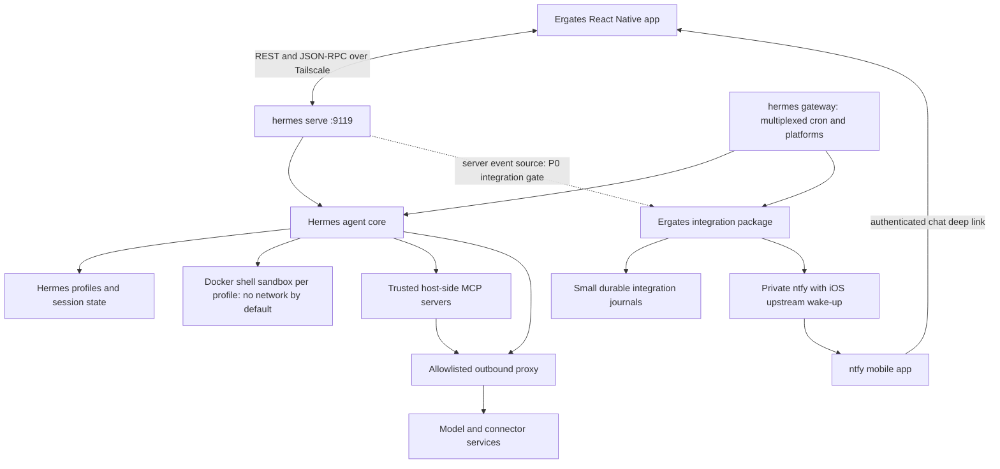

# 03 - Technical Design

Version: 0.3. Date: 2026-09-12. Depends on [02](02-functional-design.md), [10](10-mobile-design.md) and [11](11-implementation-readiness.md). Hermes pin: `d76856cc6971b6e0e1903b5369498bcc4bb83a60`, version 0.21.2. This is a design, not an executed deployment.

## 1. Boundaries

Hermes owns the agent loop, profile configuration, tools, sessions, memory, cron and rooms. Ergates builds the React Native client, deployment configuration and a small external integration package for typed agent proposals, safe provisioning, reminder deduplication and background attention. Integration receipts are the package's state; they do not replace Hermes's domain stores. Every custom capability and unverified dependency is named in [11](11-implementation-readiness.md).

Use Hermes Desktop's JSON-RPC protocol and pure TypeScript client as the reference. Vendor only needed files at the same pin, with source paths and license. Native transport, cookie storage, filesystem access and appearance application need adapters; absence of DOM globals in one client file is not proof the entire desktop package runs unchanged on React Native.

## 2. System context



`hermes serve` and `hermes gateway` are separate long-running processes sharing the Hermes data root. The gateway must explicitly multiplex secondary profiles. `serve` disables the dashboard SPA; if an admin web UI is wanted, use the dashboard mode of the server or a separately bound `hermes dashboard` process. Do not start two HTTP processes on the same address/port. The optional API server is not needed for the mobile protocol.

## 3. Components and app structure

| Concern | Choice | Boundary |
|---|---|---|
| Mobile runtime | React Native, Expo development builds, TypeScript strict | Verify required native modules and OS settings in P0; do not assume Expo Go compatibility |
| Navigation | expo-router stack/sheets | Home and chat are primary; details/settings are secondary (10) |
| Transport | Vendored `JsonRpcGatewayClient`, native HTTP/cookie/ticket adapter | Exact contract in 06; native cookie persistence is a P0 gate |
| State | TanStack Query for remote data; small client state store | In-memory history by default; local data rules in 05 |
| Theme | Vendored Hermes palette data, semantic types and pure skin converter | Nous default, system appearance; React Native application/persistence adapter (10) |
| Secure storage | expo-secure-store for credentials and draft encryption key | Do not claim a particular hardware enclave without verifying the platform |
| Rendering | Native message list, Markdown renderer, native system font | Validate table fallback, large text, safe areas and keyboard behavior |
| Voice | Native speech-recognition module in a development build | Prefer on-device support; disclose any remote transcription path |
| Notifications | ntfy app in P1; Expo transport in P2 | Server attention source, receipts and deep links are integration work |
| Tests | Recorded gateway fake, client behavior tests, device flows | Real backend and locked-phone checks complement the fake; 11 is the gate list |

```text
apps/mobile/
  app/                     # home, chat, agent details, settings and sheets
  src/gateway/             # connections, cookies/tickets, replay, error handling
  src/features/            # chat, agents, routines, files, settings; rooms/board later
  src/theme/               # native semantic tokens, palette resolution, preferences
  vendor/hermes/           # minimal upstream client + pure theme files, license, pin
  test/fake-gateway/       # sanitized fixtures and client behavior scenarios
integrations/ergates/      # external Hermes plugin and permitted server extension points
  # proposal/provisioning, attention delivery and reminder-create contracts from 11
deploy/                   # deployment configuration
  profiles/               # reviewed role templates, without credentials
  README.md               # install, update, restore, topology and evidence
  docker-compose.yml      # only checked in as runnable after P0 validation
```

These are planned paths; they do not exist yet. Package versions and native build compatibility are chosen and locked during P0 rather than implied by this document.

## 4. Connection, auth and replay

A connection has an app-generated id, label, exact base URL and auth mode. One gateway is primary in P0/P1. Each open `(connection, profile)` uses its own socket; session/cache keys additionally include the durable session identifier. Persistent connections to every agent are not a background-push mechanism.

1. `GET /api/status` discovers auth and backend identity/version. Check the supported pin/capabilities before privileged calls.
2. For the basic provider, `POST /auth/password-login` sends JSON `{provider, username, password}` and receives session cookies. Use the returned provider id; securely retain and replay cookies through the native HTTP adapter. The password need not be stored after sign-in.
3. Authenticated `GET /api/auth/me` confirms the session; `POST /api/auth/ws-ticket` returns a single-use, 30-second ticket.
4. Open `/api/ws?profile=<encoded>&ticket=<encoded>` and wait for `gateway.ready`. Mint a fresh ticket for every reconnect. Do not log tickets or full authenticated URLs.
5. Create/resume the correct Bot Chat, then submit. Byte images use `image.attach_bytes`; path images use `image.attach` after upload.
6. The vendored client replays with `session.events.since` and `last_seen`. Inspect `truncated` and replay `epoch`, not just installation identity: history recovery is needed after ring eviction and process restart. Refetch profiles/routines/config and pending requests on foregrounding.

Cookie renewal and logout behavior are tested against the basic provider. Do not call native refresh routes with a basic-session cookie as though it were an OAuth refresh token. Native PKCE is a later path: Hermes currently uses a loopback redirect; mobile app-scheme/claimed-HTTPS support and OS handoff remain a separate integration gate.

Tailscale encrypts transport between devices. Native HTTP permission/ATS behavior, cookie handling and locked-phone tailnet reachability must be validated on both OSes. If HTTPS is needed, terminate it on the private Tailscale endpoint; do not weaken certificate validation. Bind/reverse-proxy Host and peer behavior must match Hermes's request guards.

## 5. Turn and permission lifecycle

Use `prompt.submit {session_id,text}` only once per send attempt. The JSON-RPC request id correlates responses; a `request_id` parameter is not a demonstrated durable submit-idempotency mechanism. `surface: "mobile"` is not a supported model-note surface in this pin and is omitted. Busy-session queue/steer actions are explicit user choices; no speculative resend.

Render live events into one message keyed to the owning session. Persist/acknowledge according to Hermes history; do not treat an optimistic bubble as proof of durable delivery. On timeout after submission, retain “Delivery unconfirmed,” reconcile history and require deliberate retry if still uncertain. Full outbox rules are in 05.

Answer approvals with the backend request id and session id. Show command/action details only inside the authenticated app. Shell approvals are conditional checks, not a universal approval policy for all tools. Connector config updates are not immediate revocations. The transition for disabling tools is specified in 04; it is a security release gate.

## 6. Product-to-Hermes mapping

| Product concept | Hermes primitive | Additional work or limit |
|---|---|---|
| Named assistant | Profile, `ui_meta`, avatar asset, `SOUL.md` | Native roster/editor; validate every configure result |
| Concierge | Default profile and instructions | Integration tool permission to propose agents |
| Canonical chat | Session with pinned `BOT_CHAT_TITLE` | Create/resume consistently; preserve history |
| Creation by chat | No built-in Ergates action card | Typed proposal and confirmed provisioning contract in 11 |
| Exchange | `message_agent` in canonical Bot Chats | Render individual histories in P1; merged overlay P2; cross-gateway relay separate |
| Choice / approval | `clarify.*`, `approval.*` | Native cards; actual waiting/expiry semantics |
| Routine | Hermes cron | Multiplex config, timezone, safe-create receipt and push routing |
| Task board | Shared kanban tools | Agent protocol in P1, board UI in P2 |
| Memory | `MEMORY.md`, `USER.md`, session search | Read-only mobile view; user may ask agent to edit |
| Tools/connectors | Toolsets, per-profile MCP config | Narrow credentials, effective-session checks, safe config transition |
| Files | Managed HTTP routes; path/byte attachments | Server/sandbox transfer and artifact indexing are not automatic |
| Theme | Desktop semantic palettes and `HermesSkin` events | Native resolver; preserve mobile preference at reconnect |
| Push | Messaging-platform publication | Event source, durable delivery, deep links and iOS wake-up configuration |

## 7. Bot provisioning and collaboration

The accepted flow is specified in 11 section 4.1. Proposals are data until an authenticated user accepts them. The integration claims a durable receipt, reserves a profile name, creates fresh with credential mirroring disabled, applies an approved role template, verifies the effective configuration, creates the canonical chat and submits the briefing. No turn starts under an unreviewed inherited tool grant. Retrying does not create a duplicate profile or blindly resend a possibly delivered briefing.

Names, roles and avatars follow Hermes `ui_meta`; custom integration identifiers use a namespaced key if needed, respecting size and compare-and-swap constraints. A profile name is an identifier, not just a display label: rename must reconcile chat references, routine prefixes, receipts and cached handles. Display-title edits are simpler and preferred until a complete rename path is tested.

Rooms are P2. Same-gateway scheduling is a verified primitive; cross-gateway behavior may depend on a connected relay client. A roster containing remote profiles is not proof of sharing authorization or unattended room execution. Per-profile iteration limits do not constitute a global multi-agent spend cap.

## 8. Notifications and reminders

The complete integration contracts are in 11 sections 4.2–4.3. P0 must prove the event source and locked-phone delivery before P1 depends on it. Increasing `approvals.timeout` keeps a request pending but does not itself notify anyone.

Use private ntfy topics with explicit publish/subscribe access. iOS requires an upstream wake-up service; the phone subsequently retrieves the real message from the private server. The Hermes ntfy adapter at this pin does not attach a `Click` header; implement metadata forwarding and test it. Default notification content is generic. Fetch current request state after opening a deep link, including when a request expired while the phone was offline.

Cron's default in-process polling interval is 60 seconds. Retain it for ordinary reminders and measure job-start and delivery delays independently. Precise short timers are deferred, not silently implemented as an LLM sleep. Hermes owns execution; duplicate-safe creation needs the small integration receipt and gate described in 11.

## 9. Deployment contract (single VPS)

The previous Compose sketch was removed because its port, network and Docker access did not support the stated flow. Produce and validate the runnable Compose file in P0 against this wiring contract; this table is not a claim of a completed deployment.

| Component | Required wiring |
|---|---|
| `hermes-serve` | Pinned image/build with working Docker CLI; `/opt/data` Hermes data mount; host Docker daemon access restricted to this trusted controller; access to the outbound proxy; port 9119 published **only on the VPS Tailscale IP** |
| `hermes-gateway` | Same pinned image/data root; working Docker CLI and daemon access; explicit `gateway.multiplex_profiles: true`; profile-specific platform config; permitted provider/MCP/ntfy routes |
| Shell sandboxes | One identity per profile; persistent workspace mapping with host/container paths deliberately aligned; no Docker socket or provider/MCP credentials; `docker_network: false` by default |
| ntfy | Pinned image; persisted cache/auth stores; deny-by-default ACL; publish token and per-device subscriptions; private Tailscale-reachable listener; outbound upstream wake-up access |
| Outbound proxy | Explicit provider and approved connector host allowlist; the controllers' direct outbound route must not bypass it; local management ports blocked from sandboxes |
| Tailscale | On the VPS and phone; restricted service access; verify native networking and background reachability |
| Optional admin SPA | Run dashboard mode instead of serve on that HTTP endpoint, or a separate private port; account for any agent execution it can launch |

Both `serve` and `gateway` execute tools; mounting the Docker socket only into the gateway is insufficient. Keep the official image entrypoint/s6 initialization. Validate socket group access for the internal service user rather than relying on a `group_add` that may be lost on privilege drop. Record a derived image if the pin lacks required runtime packages.

The host Docker daemon resolves bind source paths on the host, not inside the controller container. A controller mount `/srv/hermes:/opt/data` does not make `/opt/data/sandboxes/...` a valid host path automatically. Record the aligned paths/explicit volumes and prove bidirectional file access before calling the workspace persistent. Never mount the entire Hermes data root into a shell sandbox.

Required profile intent (verified keys; complete templates are a P0 deliverable):

```yaml
gateway:
  multiplex_profiles: true  # default/launch profile; serves specialists' cron stores
terminal:
  backend: docker
  container_persistent: true
  container_cpu: 1
  container_memory: 1024
  container_disk: 5120
  docker_shared_container_key: ""
  docker_network: false
  docker_forward_env: []
approvals:
  mode: manual
  timeout: 1800
  cron_mode: deny
  unattended_mode: deny
```

This excerpt omits the reviewed workspace volumes, effective toolsets and MCP include lists; a profile is not ready until those are configured and tested. Container approval exemptions and host-side tools are documented in 04. Internet-enabled shell execution is deferred; if later enabled, attach the sandbox explicitly to an isolated network with enforced proxy routing and test direct-IP/DNS bypasses.

Deployment setup provisions credentials once, then starting the completed stack is one `docker compose up -d`. Pin image digests; do not use mutable ntfy/Caddy/Hermes tags. A small VPS sizing starting point is 4 vCPU, 8 GB RAM; measure concurrent sandbox use before increasing concurrency.

## 10. Operations and failures

| Condition | Recovery |
|---|---|
| Socket drops / app backgrounded | Reconnect with a fresh ticket; replay; history recovery on truncation/epoch change |
| Submit result lost | Delivery-unconfirmed state; reconcile before deliberate retry |
| Approval expired or already resolved | Show authoritative terminal state; never act from stale push data |
| Provider throttled | Render Hermes retry/wait state; keep draft; surface terminal failure |
| Tool config changed | Stop affected execution, rebuild grant, verify and only then confirm the change |
| Integration event hook unavailable | Mark dependent feature gated; do not advertise background approvals |
| Container recreated | Preserve only verified mounted data; mark background process loss visibly |
| Routine failed | Show history and delivery error separately; no false “delivered” based on job success |
| Auth expires | Follow the chosen provider's session renewal; clear on failure, preserve draft until user chooses sign-out |

Nightly backup covers all profile stores, workspace data and integration journals plus ntfy state. Use Hermes backup with a consistency-aware SQLite/WAL and file snapshot procedure, encrypt off-server copies, define retention (initially seven daily and four weekly), and test restoration onto empty storage. Do not describe live rsync alone as a consistent database backup. Before an upgrade, take a restorable snapshot; rollback restores a compatible state snapshot if schema/data changes are not backward-compatible.

Observability: `/api/health`, `hermes doctor`, per-profile logs, cron run history, integration delivery records and the optional dashboard. `/health/detailed` exists on the optional API server, not the mobile `serve` endpoint. Local app logs contain error categories/connection state, not prompts, secrets or full authenticated URLs. Redact before sharing any debug bundle.
