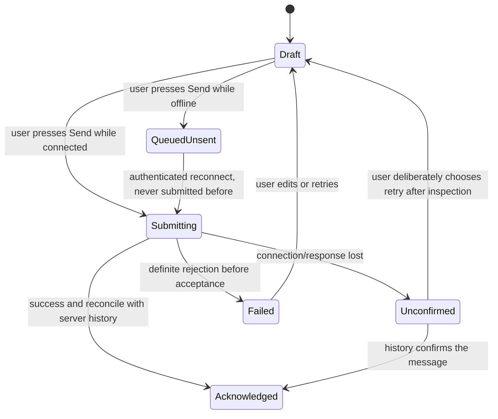

# 05 - Data Model and State Ownership

Version: 0.3. Date: 2026-09-12. Status: specified ownership; native storage and server integrations still need implementation.

## 1. Ownership

Hermes owns agent domain state. The phone owns preferences, unsent drafts and recoverable caches. The small Ergates integration owns durable receipts/delivery metadata under the Hermes data root. No separate domain database or memory index is introduced. Losing the phone does not lose server-acknowledged agent history; it can lose unsent drafts and local preferences.

## 2. Server state

| Data | Owner / location | Access and limits |
|---|---|---|
| Identity and metadata | Hermes profile directory, `profile.yaml`, `ui_meta`, assets | Profile RPC/REST; per-key metadata revisions. Friendly display-name edits preserve the directory/profile id |
| Instructions and model/tool config | Hermes `SOUL.md`, `config.yaml` | Supported profile/config calls; verify `applied` results and active-session policy |
| Credentials | Hermes profile secrets and provider-specific shared grant stores | Server-only; fresh provisioning does not mirror all launch credentials |
| Sessions/messages | Hermes `state.db` | History rows have durable `row_id`; do not confuse them with transient event sequence numbers |
| Event replay | Hermes in-process bounded ring | `seq` and `epoch`; `truncated` or new epoch requires durable-history reconciliation |
| Memory | Hermes `memories/MEMORY.md`, `USER.md` | Agent memory tool; read-only mobile view after verified server file resolution |
| Skills | Hermes per-profile skills | Toggle/install with supported routes; review permissions and required environment |
| Routines | Hermes `cron/jobs.json` and run history | Integration serializes creation and records job id; Hermes remains scheduler |
| Kanban | Hermes shared `kanban.db` | Agent tools P1, board UI P2; shared across profiles, not a tenant boundary |
| Files | Explicit host-managed paths and owning sandbox workspace | A server upload path is not automatically a sandbox path; record transfer/mount mapping |
| Rooms | Hermes room metadata/log | Same-gateway driver first; peer/relay and sharing semantics need separate verification |
| Agent proposal / acceptance receipt | Integration `ergates/proposals/` | Payload hash, origin, expiry, reserved name, completed steps, briefing delivery state; atomic write and lock |
| Reminder-create receipt | Integration `ergates/reminders/` | Idempotency key, normalized request hash, owning profile, resulting job id; reconcile uncertain writes |
| Notification/subscription state | Integration `ergates/notifications/` | Per-device destinations, per-agent preferences, event ids, attempts, resolution/expiry; seven-day terminal metadata retention |

Integration file journals are proposed interfaces in 11, not existing Hermes files. Include them in backup/restore. Secrets are referenced from the credential store, not embedded in proposal payloads or notification records. On profile deletion, cancel subscriptions/pending events and retain only the minimum receipt needed to prevent replay, according to an explicit retention rule.

## 3. Phone state and retention

| Store | Content | Initial policy |
|---|---|---|
| Connection registry | App UUID, label, base URL, auth mode, primary flag, last profile | AsyncStorage; no secrets; delete on connection removal |
| Credentials | Basic-provider session material or later native tokens | SecureStore/native cookie adapter; clear matching native cookie jar too on logout/removal |
| Theme/preferences | Appearance, Hermes theme selection/cache, locale, haptics | AsyncStorage; can survive sign-out without retaining account data |
| Roster organization | Pins/order, named sections/membership, reading watermarks/manual unread, collapsed state | Device-local, keyed by connection/profile; clear on sign-out/removal. Never write mobile-only organization into desktop metadata |
| Query cache | Roster, history pages, jobs, tool lists | Memory-only by default. Optional “Keep recent chats offline” permits app-private cache with 24-hour TTL and explicit clear action |
| Replay watermark | Owning connection/profile/session, `seq`, replay `epoch` | Memory; optionally persist with offline cache. Discard stale epoch and reconcile history |
| Drafts/outbox | Text, local attachment references, local send id, state | Encrypted app-private storage with key in SecureStore; retained until sent/discarded; unsent items expire after seven days with a visible retention notice |
| Bot editor draft | Base snapshot, metadata revisions, changed fields, local avatar reference, per-section save outcomes | Memory while editing; explicit recovery draft uses the encrypted draft store/TTL. Clear on successful save, discard, sign-out or connection removal; never auto-apply after reconnect |
| Downloaded/preview files | Temporary attachments | App-private cache; clear within 24 hours and on sign-out/removal. Explicit user exports belong to the chosen external destination |
| Push registration | Device token and registered connection | Server registration plus secure local reference; revoke subscription on logout/removal |
| Debug buffer | Sanitized connection/error categories | Bounded local cache, no bodies/tokens; opt-in share with preview |

The optional chat cache is sensitive device data even when the OS protects app storage. Do not claim it exists only on the VPS or is protected by SecureStore merely because credentials are. Decide platform backup exclusions and device protection settings during P0. Removing a connection clears all its drafts, outbox, cached content, files, watermarks and credentials; warn specifically about losing unsent work. Exported files are outside the app's clearing authority.

Notification preferences are server-owned delivery settings once the integration exists. A cached phone setting is only the last known value; show pending synchronization and do not claim it has muted remote publication while offline.

### Bot metadata compatibility

The desktop namespace `ui_meta['hermes-bots']` carries `title` (friendly name), avatar shape/color/image kind, `hidden` and its own `pinned`/`sectionId`. Preserve unknown fields and desktop organization on every mobile edit; image bytes go through the asset API, not the 64 KB metadata payload. Store the proposed separate role badge in `ui_meta.ergates.role`. An absent badge is omitted, not inferred from a personal name. Metadata writes carry expected revisions for each touched namespace.

Hermes desktop section membership is metadata, while its section definitions live in plugin storage (`user-sections.ts`). Ergates therefore defines mobile sections and pins as device-local; it does not claim cross-client synchronization. Shared Hide remains in Hermes metadata and has a Hidden Bots recovery list. Read/unread is a reader preference, not proof of agent-message delivery. Notification suppression is independent of Hide.

Mobile organization keeps a section's stable id/name and collapsed state under its connection, and separate `sectionId` (nullable) and `pinned`/pin order fields per connection/profile. Pin/unpin never rewrites `sectionId`; moving sections never rewrites pin state. Derive the pinned area from visible pinned bots and each section's rows from its visible unpinned members. A collapsed section suppresses its rows only, not its pinned members. Keep the section definition/header when all members are pinned. Section removal clears membership and collapsed state for that section while preserving pins. Persist all three concerns across relaunch so unpinning Linh or Kevin still returns them to Prive (FR-13D).

The editor's Save spans independent profile, avatar, config and subscription operations. Track confirmed and failed sections; cancellation after a partial save discards only unsaved edits. Existing revision checks do not protect all non-metadata fields against concurrent writers; the limits and acceptance gate are in 10 and 11.

## 4. Identifier and replay rules

| Identifier | Scope |
|---|---|
| `connection_id` | App-generated UUID identifying a saved trusted gateway |
| Profile name | Unique within one gateway; mutable through an explicit rename workflow |
| Session | Owning connection + profile + durable Hermes session id |
| Message | Owning session + durable `row_id` |
| Replay event | Owning session + replay `epoch` + `seq`; transient, not a durable message id |
| Approval/clarify | Owning session + backend `request_id` |
| Proposal/job-create request | Integration-generated id + approved payload hash |
| Local send | App-generated UUID for local tracking only; not a proven upstream dedup key |
| Room/job | Owning gateway/profile as applicable + Hermes id |

Never key caches or deep links solely by a profile name or session id across all gateways. Handles such as `@name-device` are display/routing conventions, not authorization. A deep link selects a previously trusted connection; it never adds a backend or executes an approval by itself.

## 5. Outbox state machine

Persist Submitting before writing the request. On app restart, recover Submitting as Unconfirmed, never QueuedUnsent. Disable automatic mutation retries for `prompt.submit` and other non-idempotent operations. Identical text is not a reliable receipt: when history cannot distinguish two identical user messages, preserve uncertainty and let the user decide. JSON-RPC ids correlate a response on a connection; they do not provide durable exactly-once execution.

Fetch history/pending requests after replay truncation or restart, merge by durable row id, and reconcile optimistic bubbles. Query caches and event rings are not a source of truth for final message delivery or current approval state.
