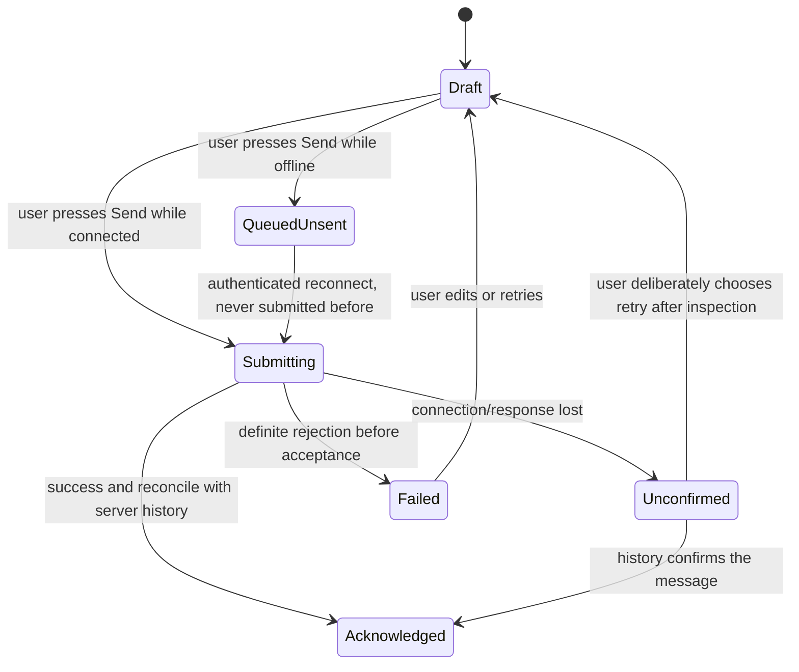

# 05 - Data Model and State Ownership

Version: 0.3. Date: 2026-09-12. Status: specified ownership; native storage and server integrations still need implementation.

## 1. Ownership

Hermes owns agent domain state. The phone owns preferences, unsent drafts and recoverable caches. The small Ergates integration owns durable receipts/delivery metadata under the Hermes data root. No separate domain database or memory index is introduced. Losing the phone does not lose server-acknowledged agent history; it can lose unsent drafts and local preferences.

## 2. Server state

| Data | Owner / location | Access and limits |
|---|---|---|
| Identity and metadata | Hermes profile directory, `profile.yaml`, `ui_meta`, assets | Profile RPC/REST; per-key metadata revisions. Friendly display-name edits preserve the directory/profile id |
| Instructions and model/tool config | Hermes `SOUL.md`, `config.yaml` | Supported profile/config calls; verify `applied` results and active-session policy |
| Credentials | Hermes profile secrets and provider-specific shared grant stores | Server-only; fresh provisioning does not mirror all launch credentials |
| Sessions/messages | Hermes `state.db` | History rows have durable `row_id`; do not confuse them with transient event sequence numbers |
| Event replay | Hermes in-process bounded ring | `seq` and `epoch`; `truncated` or new epoch requires durable-history reconciliation |
| Memory | Hermes `memories/MEMORY.md`, `USER.md` | Agent memory tool; read-only mobile view after verified server file resolution |
| Skills | Hermes per-profile skills | Toggle/install with supported routes; review permissions and required environment |
| Routines | Hermes `cron/jobs.json` and run history | Integration serializes creation and records job id; Hermes remains scheduler |
| Kanban | Hermes shared `kanban.db` | Agent tools P1, board UI P2; shared across profiles, not a tenant boundary |
| Files | Explicit host-managed paths and owning sandbox workspace | A server upload path is not automatically a sandbox path; record transfer/mount mapping |
| Rooms | Hermes room metadata/log | Same-gateway driver first; peer/relay and sharing semantics need separate verification |
| Agent proposal / acceptance receipt | Integration control store, tables `proposal_receipts` and `proposal_steps` | Payload hash, origin, expiry, reserved name, completed steps, briefing delivery state; atomic write and lock |
| Reminder-create receipt | Integration control store, table `reminder_receipts` | Idempotency key, normalized request hash, owning profile, resulting job id; reconcile uncertain writes |
| Notification/subscription state | Integration control store, tables `attention_events`, `attention_outbox` and `attention_prefs` | Per-device destinations, per-agent preferences, event ids, attempts, resolution/expiry; seven-day terminal metadata retention |

The integration control store (`<hermes root>/ergates/control.sqlite3`, ADR-030) is not a Hermes file. Include it in backup/restore with a SQLite-consistent copy. Secrets are referenced from the credential store, not embedded in proposal payloads or notification records. On profile deletion, cancel subscriptions/pending events and retain only the minimum receipt needed to prevent replay, according to an explicit retention rule.

## 3. Phone state and retention

| Store | Content | Initial policy |
|---|---|---|
| Connection registry | App UUID, label, base URL, auth mode, primary flag, last profile | The encrypted device blob (below); no secrets; delete on connection removal |
| Credentials | Basic-provider session material or later native tokens | SecureStore/native cookie adapter; clear matching native cookie jar too on logout/removal |
| Theme/preferences | Appearance, Hermes theme selection/cache, locale, haptics | The encrypted device blob (below); can survive sign-out without retaining account data |
| Roster organization | Pin order, the manual row order (`rowOrder`), the section list (id, name, order, collapsed state, empty sections too), reading watermarks/manual unread, exchange acknowledgements (bot-to-bot activity identities the reader has opened; no cap, never evicted), and the organization outbox (pin and section changes Hermes does not have yet) | Device-local, keyed by connection/profile; clear on sign-out/removal, the organization outbox too. Which agents are pinned and each agent's section live in Hermes metadata ("Bot metadata compatibility" below) |
| Query cache | Roster, history pages, jobs, tool lists | Memory-only by default. Optional “Keep recent chats offline” permits app-private cache with 24-hour TTL and explicit clear action |
| Replay watermark | Owning connection/profile/session, `seq`, replay `epoch` | Memory; optionally persist with offline cache. Discard stale epoch and reconcile history |
| Drafts/outbox | Text, local attachment references, local send id, state | Encrypted app-private storage with key in SecureStore; retained until sent/discarded; unsent items expire after seven days with a visible retention notice |
| Bot editor draft | Base snapshot, metadata revisions, changed fields, local avatar reference, per-section save outcomes | Memory while editing; explicit recovery draft uses the encrypted draft store/TTL. Clear on successful save, discard, sign-out or connection removal; never auto-apply after reconnect |
| Downloaded/preview files | Temporary attachments | App-private cache; clear within 24 hours and on sign-out/removal. Explicit user exports belong to the chosen external destination |
| Push registration | Device token and registered connection | Server registration plus secure local reference; revoke subscription on logout/removal |
| Debug buffer | Sanitized connection/error categories | Bounded local cache, no bodies/tokens; opt-in share with preview |

Connections, roster organization, preferences, drafts, the outbox and unfinished agent setups are one JSON blob in AsyncStorage, sealed with AES-256-GCM from expo-crypto (ADR-033). Its key is created on the first write and kept in SecureStore with `WHEN_UNLOCKED_THIS_DEVICE_ONLY`. That setting applies on iOS only: there the key is readable only while the phone is unlocked and is never restored onto another device, so app data restored onto a new iPhone starts with an empty device store (Hermes-owned history stays on the server). On Android the setting has no effect: expo-secure-store keeps the key encrypted with an Android Keystore key, readable whenever the app runs. A plaintext blob from an earlier app version is read once and rewritten sealed at once; a sealed blob that cannot be opened now is kept for the next launch, not overwritten.

The optional chat cache is sensitive device data even when the OS protects app storage. Do not claim it exists only on the VPS or is protected by SecureStore merely because credentials are. Decide platform backup exclusions and device protection settings during P0. Removing a connection clears all its drafts, outbox, cached content, files, watermarks and credentials; warn specifically about losing unsent work. Exported files are outside the app's clearing authority.

Notification preferences are server-owned delivery settings once the integration exists. A cached phone setting is only the last known value; show pending synchronization and do not claim it has muted remote publication while offline.

### Bot metadata compatibility

The desktop namespace `ui_meta['hermes-bots']` carries `title` (friendly name), avatar shape/color/image kind, `hidden` and its own `pinned`/`sectionId` (and `sectionName` in newer versions). Preserve unknown fields and desktop organization on every mobile edit; image bytes go through the asset API, not the 64 KB metadata payload. Store the proposed separate role badge in `ui_meta.ergates.role`. An absent badge is omitted, not inferred from a personal name. Metadata writes carry expected revisions for each touched namespace.

Pins and section membership are shared with Hermes Desktop through this metadata: the phone reads `pinned`, `sectionId` and `sectionName` from `ui_meta['hermes-bots']` and writes them through `profiles.configure` with the agent's whole namespace (unknown fields kept) and its expected revision, the path Hide uses. Desktop writes the same fields without a revision check (last write wins). A missing value and `false`/`null` mean the same to Desktop (not pinned, no section); the phone keeps them apart only for the first sync below. Desktop keeps its section definitions (names, order, empty sections) in its own plugin storage (`user-sections.ts`, key `bot-sections-v1`), so the section list stays per device: the phone keeps its own definitions and adds a section it finds only on agents at the end, named from an agent's `sectionName`, or "Untitled section" when no agent carries one (older Hermes). A local section whose members all left stays until the owner deletes it. A local section's shown name is its local name while a member (or a queued section change) still carries that name; otherwise the name most of its members carry, ties going to the first such member in roster order; otherwise the local name stays. Pin order, row order, collapsed state and read/unread stay per device. Shared Hide remains in Hermes metadata and has a Hidden Bots recovery list. Read/unread is a reader preference, not proof of agent-message delivery. Notification suppression is independent of Hide.

The pinned agents are the ones Hermes marks `pinned: true`, shown in the phone's pin order: a pinned agent the order does not know yet joins at its end (latest activity first), and an agent Hermes no longer marks pinned leaves it. An agent's section is its `sectionId` in Hermes (null or missing is No section). Every organizing action runs on that shared view: Pin/Unpin writes `pinned`; Move to, a drop into another group and Create section (with its move) write `sectionId` and `sectionName` on each moved agent; Rename section writes the new `sectionName` on every member; Delete section writes `sectionId: null, sectionName: null` on every member; reordering rows, pins and sections and collapsing write nothing. Pin/unpin never rewrites `sectionId`; moving sections never rewrites pin state.

The first roster read after the update runs once per connection. A Hermes value always wins. Where Hermes has no `pinned` or `sectionId` value yet, an organization stored before the update writes its local pin or section, so nothing organized on the phone is lost; it never overwrites a Hermes value. On a new install (no organization on this phone for the connection) the only write is the concierge pin, when Hermes has no `pinned` value for it; an existing value, "not pinned" set on Desktop included, is never changed.

The manual row order, `rowOrder`, is one manual order of profile names per connection: every group (no section, or one section) shows its rows in that order, and activity never reorders it. A profile the order does not know yet shows first in its group, latest activity first, and Home records it at the front as soon as the roster loads, so it never moves by itself. On the first load after the update every profile is new, so the list keeps today's activity order and then stays still. Hidden profiles keep their place; deleting a profile removes it from the order, so a new profile with the same name starts at the top. Stored data without `rowOrder` loads with an empty one. Derive the pinned area from visible pinned bots and each section's rows from its visible unpinned members. A collapsed section suppresses its rows only, not its pinned members. Keep the section definition/header when all members are pinned. Section removal clears membership and collapsed state for that section while preserving pins. Unpinning Linh or Kevin still returns them to Prive (FR-13D), on every device that reads the same Hermes.

The editor's Save spans independent profile, avatar, config and subscription operations. Track confirmed and failed sections; cancellation after a partial save discards only unsaved edits. Existing revision checks do not protect all non-metadata fields against concurrent writers; the limits and acceptance gate are in 10 and 11.

### Organization outbox

Organizing works offline, as before. Every pin and section change shows on Home at once and waits in a small outbox inside the encrypted device blob, then goes to Hermes, one change at a time in the order made; several agents are several writes, each succeeding or failing on its own. A newer change to the same agent and field replaces a queued one. A change stays in the outbox, and wins over a roster read, until Hermes has it: a sent change leaves once a roster read shows the revision its write produced, so an answer that left Hermes before the write cannot undo it on screen. A write whose answer never came (the app stopped) is sent again after a restart; repeating the same values is harmless. Without a connection, on a timeout, when sign-in has expired, when the gateway answers busy or rate-limited, or on a 502, 503 or 504 from a reverse proxy while Hermes restarts, the change stays queued like a lost connection; the flush then waits until a roster read newer than the one it stalled on succeeds, and sends the queue again then. On a revision conflict the phone reads that agent again, applies the same change once more, and writes with the new revision; a second conflict, or any other error, refuses the change: it leaves the outbox, the agent shows what Hermes has, and one alert names the agents ("Could not move 2 agents: Linh and Kevin. They show what Hermes has."). Desktop may still overwrite a phone change later, because it does not check revisions. Signing out or removing the connection clears its outbox, with the same warning as unsent chat messages. Changes go out only while Home is mounted and open. When Hermes no longer has an agent (deleted after the last roster read, or a conflict's re-read no longer finds it), its queued change is dropped without an alert.

## 4. Identifier and replay rules

| Identifier | Scope |
|---|---|
| `connection_id` | App-generated UUID identifying a saved trusted gateway |
| Profile name | Unique within one gateway; mutable through an explicit rename workflow |
| Session | Owning connection + profile + durable Hermes session id |
| Message | Owning session + durable `row_id` |
| Replay event | Owning session + replay `epoch` + `seq`; transient, not a durable message id |
| Approval/clarify | Owning session + backend `request_id` |
| Proposal/job-create request | Integration-generated id + approved payload hash |
| Local send | App-generated UUID for local tracking only; not a proven upstream dedup key |
| Room/job | Owning gateway/profile as applicable + Hermes id |

Never key caches or deep links solely by a profile name or session id across all gateways. Handles such as `@name-device` are display/routing conventions, not authorization. A deep link selects a previously trusted connection; it never adds a backend or executes an approval by itself.

## 5. Outbox state machine

```mermaid
stateDiagram-v2
  [*] --> Draft
  Draft --> QueuedUnsent: user presses Send while offline
  Draft --> Submitting: user presses Send while connected
  QueuedUnsent --> Submitting: authenticated reconnect, never submitted before
  Submitting --> Acknowledged: success and reconcile with server history
  Submitting --> Unconfirmed: connection/response lost
  Submitting --> Failed: definite rejection before acceptance
  Unconfirmed --> Acknowledged: history confirms the message
  Unconfirmed --> Draft: user deliberately chooses retry after inspection
  Failed --> Draft: user edits or retries
```

Persist Submitting before writing the request. On app restart, recover Submitting as Unconfirmed, never QueuedUnsent. Disable automatic mutation retries for `prompt.submit` and other non-idempotent operations. Identical text is not a reliable receipt: when history cannot distinguish two identical user messages, preserve uncertainty and let the user decide. JSON-RPC ids correlate a response on a connection; they do not provide durable exactly-once execution.

Fetch history/pending requests after replay truncation or restart, merge by durable row id, and reconcile optimistic bubbles. Query caches and event rings are not a source of truth for final message delivery or current approval state.
