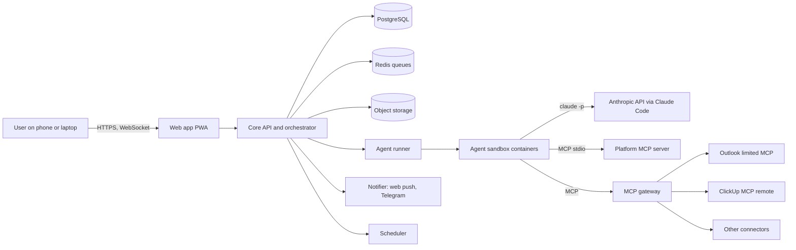
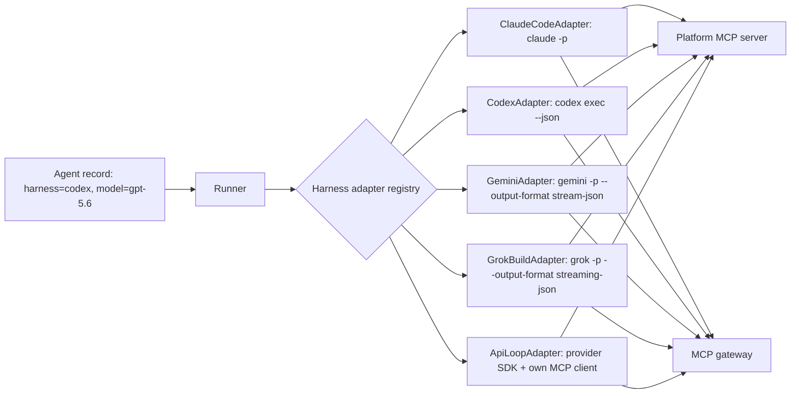
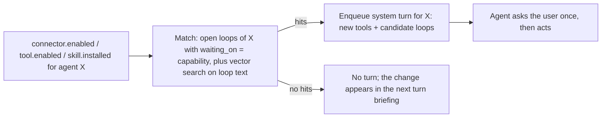

# 03 - Technical Design

| Field | Value |
|---|---|
| Version | 0.1 draft |
| Date | 2026-09-12 |
| Depends on | 02-functional-design.md, research/notes-claude-platform-facts.md |

## 1. Design principles

1. **Chat is the API.** Every capability is reachable by talking; forms exist only where a click is faster.
2. **Unmodified vendor harnesses as the brain, chosen per agent.** Each agent turn runs an official agent binary in headless mode: Claude Code, Codex CLI, Gemini CLI, or Grok Build. The platform detects what is installed and logged in on the server and offers only that. Every harness sits behind one adapter interface; a built-in API-loop harness (API keys, any provider) is the long-term fallback. Agent identity, memory, files, routines, and tool policy belong to the platform, so an agent can switch harness later.
3. **Tools only through MCP.** Agents have no cloud desktop. They have a workspace directory, a sandbox shell, and MCP tools. Every tool is switchable.
4. **Two-layer enforcement.** A disabled tool is removed from the tool list (layer 1) and rejected by a gateway if called anyway (layer 2).
5. **Everything is an event.** Messages, tool calls, approvals, routine runs, and agent-to-agent traffic are events in one log. The UI renders the log.
6. **One VPS, one compose file.** No Kubernetes in Phases 1-2.

## 2. System context



## 3. Components

| Component | Responsibility | Technology (recommended) |
|---|---|---|
| Web app | Chat UI, cards, details panels, catalog, settings, PWA, push subscription | Vite + React SPA, TypeScript, Tailwind, WebSocket client (ADR-016) |
| Core API | REST + WebSocket, auth, threads, agents, jobs, routines, connectors, approvals, usage, events | Node 22, TypeScript, Fastify 5, Drizzle ORM, Zod (ADR-016) |
| Scheduler | Cron and one-shot triggers, webhook triggers, retries, run history | BullMQ on Redis (delayed and repeatable jobs) |
| Agent runner | Turn queue per agent, spawns a turn in the agent's sandbox, streams events back, enforces concurrency and rate limits | Node worker process, Docker Engine API |
| Agent sandbox | One container per agent with the Claude Code CLI, workspace volume, no inbound network, egress only to Anthropic and the MCP gateway | Docker image `jopbot/agent-sandbox` (node + claude CLI + python + libheif tools) |
| Platform MCP server | Tools agents use to talk to the platform: messages, agents, routines, jobs, memory, files, questions, approvals | TypeScript, `@modelcontextprotocol/sdk`, stdio transport inside the sandbox, talks to the core API over an internal token |
| MCP gateway | Fronts every external connector: filters `tools/list` by policy, blocks disallowed `tools/call`, injects credentials, logs calls | TypeScript MCP proxy (HTTP transport to sandboxes) |
| Connectors | Local stdio MCP servers (for example the Outlook limited fork) or remote HTTP MCP servers (ClickUp official) | As provided; OAuth handled by the core |
| Notifier | Web push (VAPID), optional Telegram bot, email later | web-push, grammY |
| Object storage | Uploads, generated files, avatars, template archives | Local disk behind a `FileStore` interface; MinIO adapter in Phase 3 (ADR-016) |
| Reverse proxy | TLS, HTTP/2, WebSocket | Caddy |
| Observability | Logs, metrics, traces | pino logs, Prometheus metrics, optional Grafana |

Why TypeScript: the MCP SDK, the Claude Agent SDK, and Claude Code itself are TypeScript-first; one language across web, core, and MCP servers (Assumption A2).

## 4. Harness layer (multi-vendor runtime)

### 4.0 Concept
A harness is the vendor's agent runtime: model loop, built-in tools (files, shell), MCP client, sessions. The platform never re-implements these. It drives the harness headless, feeds it the agent's context, and reads its event stream. Verified capabilities per harness are in research/notes-harness-facts.md.



### 4.0.1 Harness detection (the "Buzz" behavior)
The runner ships a detector that runs at startup, on a schedule (hourly), and on "Re-scan":

| Harness | Binary probe | Login probe | Models |
|---|---|---|---|
| Claude Code | `claude --version` | `CLAUDE_CODE_OAUTH_TOKEN` set, or credentials file present in the harness home; a 1-token test prompt confirms | static list + custom |
| Codex CLI | `codex --version` | `~/.codex/auth.json` present (ChatGPT login) or `CODEX_API_KEY`/`OPENAI_API_KEY` set; test prompt | static list + custom |
| Gemini CLI | `gemini --version` | cached Google credential in `~/.gemini` or `GEMINI_API_KEY`/Vertex vars; test prompt | static list + custom (`auto` default) |
| Grok Build | `grok --version` | cached token from `grok login` or `XAI_API_KEY`; test prompt | static list + custom |

The result is stored in `harness_status` (installed, version, auth kind: subscription or api_key, account label, last check, last error) and shown in Settings > Harnesses. The UI's "Agent harness" dropdown lists only harnesses with `installed && authenticated`.

Where the login happens: the operator logs in once on the server host (`claude setup-token`, `codex login --device-auth`, `gemini` with `NO_BROWSER`, `grok login`). Credential files live in a host directory `/srv/harness-home/<harness>/` that the runner mounts read-only into each sandbox at the harness's expected home (`CLAUDE_CONFIG_DIR`, `CODEX_HOME`, `HOME/.gemini`, `HOME/.grok`). Per-agent settings and sessions are kept in the agent's own volume, separate from the shared credential directory.

### 4.0.2 Adapter interface (harness-neutral)

### 4.1 Interface
```ts
interface LlmRunner {
  runTurn(input: TurnInput): AsyncIterable<TurnEvent>; // streams events
  interrupt(turnId: string): Promise<void>;
}
interface TurnInput {
  agentId: string; threadId: string; sessionId?: string;
  messages: InboundMessage[];      // user text, files, agent messages, routine instruction
  systemPromptAppend: string;      // identity + memories + protocols
  mcpServers: McpServerConfig[];   // platform MCP + gateway endpoints for this agent
  allowedTools: string[]; disallowedTools: string[];
  model: string; effort: 'low'|'medium'|'high'|'xhigh'|'max';
  maxTurns: number; timeoutMs: number;
}
```
Every adapter also declares a capability descriptor so the UI and the runner know what to show and what to compensate for:

```ts
interface HarnessCapabilities {
  streaming: boolean; resume: boolean; mcpStdio: boolean; mcpHttp: boolean;
  perToolPolicyInConfig: boolean; permissionHook: boolean; structuredOutput: boolean;
  settings: Array<'effort'|'reasoning'|'approvalMode'|'sandboxLevel'|'maxTurns'>;
  auth: Array<'subscription'|'api_key'>;
}
```

| Adapter | Command shape | Auth | Status |
|---|---|---|---|
| `ClaudeCodeAdapter` | `claude -p --output-format stream-json --resume <id> --mcp-config ... --settings ... --model ... --effort ...` | `CLAUDE_CODE_OAUTH_TOKEN` (Max) or `ANTHROPIC_API_KEY` | Phase 0 |
| `CodexAdapter` | `codex exec --json [resume <id>] --sandbox workspace-write -m <model>` with `[mcp_servers.*]` written to a per-agent `CODEX_HOME/config.toml` | `~/.codex/auth.json` (ChatGPT plan) or `CODEX_API_KEY` | Phase 1 (proves the abstraction) |
| `GeminiAdapter` | `gemini -p --output-format stream-json --resume <id> --approval-mode yolo --allowed-mcp-server-names ... -m <model>` with `mcpServers` in a per-agent `settings.json` | cached Google login or `GEMINI_API_KEY` | Phase 2 |
| `GrokBuildAdapter` | `grok -p --output-format streaming-json -s <session> --always-approve -m <model> --cwd /agent/workspace` | `grok login` (SuperGrok / X Premium+) or `XAI_API_KEY` | Phase 2 (MCP config keys to verify) |
| `ApiLoopAdapter` | Own loop with provider SDKs (Anthropic, OpenAI, Google, xAI) and the platform's MCP client | API keys only | Phase 3 |
| `AgentSdkAdapter` | `@anthropic-ai/claude-agent-sdk` | `ANTHROPIC_API_KEY` | Phase 3, optional |

### 4.0.3 Filling the gaps (what the adapter does when a harness lacks a feature)

| Missing capability | Compensation in the platform |
|---|---|
| No permission prompt hook (Codex, Gemini, Grok) | Approvals move to the MCP gateway for all harnesses: an "ask" tool call is held open by the gateway (up to 30 min) while the approval card is shown; allow continues the call, deny returns an MCP error. Claude Code's hook stays as an optional extra for built-in tools. |
| No per-tool allow/deny in the harness config | The gateway's filtered `tools/list` and `tools/call` checks are the only source of truth; harness config lists servers only. |
| Different tool naming (`mcp__s__t`, `mcp_s_t`) | Policy is stored harness-neutral as (server, tool); adapters render names. |
| No or fragile resume, or harness switched | Context replay: the platform rebuilds a prompt from its own message store (summary of older turns + last N messages) and starts a fresh harness session. |
| No structured output | The platform parses the final message with a small extraction pass when a schema is required. |
| Images | Files are placed in the workspace inbox; harnesses with image reading (all four have file tools) read them; the platform adds an image description via the extraction pass as a fallback. |
| Different event formats | Each adapter maps the vendor stream to the platform's `TurnEvent` union (text delta, tool call, tool result, status, result with usage). |

Consequence: tool policy and approvals never depend on a harness feature. This is what makes a harness switch safe.

### 4.1 Interface (unchanged for callers)

### 4.2 Claude Code invocation (per turn, reference adapter)
The runner executes inside the agent's sandbox container (other adapters follow the same pattern with their own flags, see research/notes-harness-facts.md):

```bash
CLAUDE_CONFIG_DIR=/agent/claude \
CLAUDE_CODE_PROJECT_DIR_NAME=workspace \
CLAUDE_CODE_OAUTH_TOKEN=<from secret store> \
claude -p \
  --output-format stream-json --verbose --include-partial-messages \
  --input-format stream-json \
  --session-id <uuid>            # first turn of a session; --resume <uuid> on later turns
  --append-system-prompt-file /agent/prompt/turn.md \
  --mcp-config /agent/mcp/turn.json --strict-mcp-config \
  --settings /agent/settings/turn.json \
  --permission-mode default \
  --permission-prompt-tool mcp__platform__approval \
  --model claude-opus-5 --effort high \
  --max-turns 40 --name "agent:<name>"
```
Facts that shape this (all from the official docs, see research/notes-claude-platform-facts.md):
- `--bare` must not be used on the subscription path because bare mode does not read `CLAUDE_CODE_OAUTH_TOKEN`. Isolation is achieved with `CLAUDE_CONFIG_DIR` (own settings, credentials, projects, memory) and a dedicated working directory.
- `--resume` does not restore `--mcp-config`, `--settings`, `--add-dir`; the runner passes them on every turn.
- `--permission-prompt-tool` lets an MCP tool answer permission prompts. The platform MCP server implements it: it creates an approval card, pushes a notification, waits (with timeout) for the user's decision, and returns allow or deny.
- `AskUserQuestion` is a terminal tool; in headless mode the platform provides its own `ask_user` MCP tool that renders choice cards.
- The `result` event carries `session_id`, usage, `total_cost_usd` (estimate), `permission_denials`. The runner stores these per turn.
- Transcripts are stored by Claude Code at `/agent/claude/projects/workspace/<session-id>.jsonl`. The platform treats them as opaque and keeps its own message store.
- Compaction is automatic in Claude Code; the platform also caps `--max-turns` and turn wall-clock time.

### 4.3 Sessions
- One Claude session per (agent, thread). The primary 1:1 thread and each group thread get their own session id, stored on the thread participant record.
- Agent-to-agent exchanges run in the receiving agent's primary session (so the agent keeps one coherent memory) with the message marked as coming from another agent.
- Routine runs use the agent's primary session.
- Memory across sessions comes from injected memories, `CLAUDE.md` in the agent config dir, and workspace files.

### 4.4 Settings JSON passed per turn
```json
{
  "permissions": {
    "allow": ["Read", "Write", "Edit", "Glob", "Grep", "Bash(python3 *)", "Bash(unzip *)", "mcp__platform", "mcp__gw_outlook__list_mail_messages", "mcp__gw_outlook__get_mail_message"],
    "deny":  ["WebFetch", "WebSearch", "mcp__gw_outlook__send_mail", "mcp__gw_outlook__reply_to_mail_message", "mcp__gw_outlook__forward_mail_message", "mcp__gw_outlook__delete_mail_message"],
    "ask":   ["mcp__gw_outlook__update_mail_message", "mcp__gw_clickup__delete_task"]
  },
  "env": { "MCP_TIMEOUT": "30000", "MAX_MCP_OUTPUT_TOKENS": "25000" }
}
```
The allow/deny/ask lists are generated from: connector tool switches (account level) minus per-agent overrides plus approval rules. Deny always wins.

### 4.5 Concurrency and rate limits
- Per agent: one active turn at a time; a queue per agent (FIFO) so messages are not lost.
- Global: configurable maximum of concurrent turns (default 3) to stay inside the subscription's rolling window.
- On `system/api_retry` with `rate_limit`: the runner backs off; the thread shows "Waiting for capacity"; routines are retried with jitter.
- Usage accounting: tokens from `result.usage` per turn stored per agent and per day; a 5-hour rolling and weekly counter drives warnings (FR-240).

## 5. Turn lifecycle

```mermaid
sequenceDiagram
  participant U as User
  participant API as Core API
  participant R as Runner
  participant S as Sandbox (claude -p)
  participant P as Platform MCP
  participant G as MCP gateway
  U->>API: POST message (text, files)
  API->>API: store message, emit event, enqueue turn(agent, thread)
  R->>S: spawn claude -p --resume session (stream-json)
  S->>P: ask_user / remember / create_job / send_message
  P->>API: internal call, emit events (cards, rows)
  S->>G: tools/call outlook.list_mail_messages
  G->>G: check policy, inject token, log
  G-->>S: result
  S-->>R: assistant text deltas, tool_use, tool_result, result
  R->>API: stream events; on result store usage + session id
  API-->>U: WebSocket updates (typing, text, cards)
```

Approval path: `S -> P (approval tool) -> API creates approval card + push -> user decides -> P returns allow/deny -> S continues`. Default timeout 30 minutes, then deny with a clear message; the agent can ask again later.

## 6. Agent-to-agent messaging

- `send_message(to_agent_id, text, kind)` in the platform MCP. `kind` is `brief`, `task`, `report`, `ping`, `info`.
- The core stores the message in the exchange thread (A,B), emits an event row in both agents' primary threads ("Messaged B" / "Message from A"), and enqueues a turn for B with the message and the sender's identity.
- B's reply through `send_message(to_agent_id=A)` follows the same path. Hop counter and per-hour caps (FR-143) are enforced in the core; when exceeded the tool returns an error telling the agent to ask the user.
- `broadcast(to_agent_ids[], text)` fans out and renders one "Messaged N agents" row.
- `create_agent(name, title, description, instructions, skills[], connectors[], briefing)` creates the record, provisions the sandbox, stores the briefing as the first exchange message, and enqueues the child's first turn. The parent id is stored (FR-130).

## 7. Group threads

- A group thread has one session per participating agent.
- Turn policy (Phase 2 default): an agent responds when addressed by @name or when the user's message has no address and the agent is the thread's "lead" (first agent added). Other agents receive the message as context but stay silent unless mentioned. Agents may mention each other, subject to the hop cap.
- Every agent message in the group carries a sender label; the UI shows it (FR-109).

## 8. Routines and timers

- Storage: `routine` table with triggers; BullMQ repeatable jobs for cron, delayed jobs for one-shot, an HTTP endpoint with a secret for webhooks.
- Idempotency: the platform MCP `create_routine` requires an `idempotency_key` derived from the turn id and a hash of the request; duplicates return the existing routine (FR-175).
- Firing: the scheduler enqueues a turn with `kind: routine` and the instruction plus attachments; on success one-shot routines are deleted and an event row is written; failures are shown in run history and retried up to 3 times with backoff.
- Timers under 1 hour use the same path with second-level delay; the notifier sends a push as soon as the turn posts its message (FR-174). If the turn takes longer than 10 seconds, the notifier sends the reminder text itself first, then the agent's message.

## 9. Tool policy enforcement (two layers)

| Layer | Where | Mechanism |
|---|---|---|
| 1 | Claude Code | `permissions.deny` and a filtered `tools/list` from the gateway; the model never sees disabled tools |
| 2 | MCP gateway | Every `tools/call` is checked against the effective policy for (agent, connector, tool); disallowed calls return an MCP error and are logged; "ask" tools trigger the approval path |

The gateway is the only network path from sandboxes to connectors. Sandboxes have egress rules allowing only the Anthropic API host and the gateway.

Effective policy = connector default switches ∩ agent connector assignment ∩ agent tool overrides, then approval rules decide allow/ask, then built-in hard limits.

## 10. Files pipeline

1. Upload to core (multipart) -> object storage -> `file` record.
2. The runner copies the file into `/agent/workspace/inbox/<message-id>/` before the turn and lists the paths in the turn prompt.
3. Images: converted to JPEG (HEIC via libheif) and passed as image content in the stream-json user message so the model can see them.
4. Agent output: `share_file(path)` in the platform MCP copies the file to object storage and creates a file card message.
5. Retention: inbox files older than 30 days are pruned; shared files are kept.

## 11. Memory

| Layer | Content | How it reaches the model |
|---|---|---|
| Memory entries (DB) | Facts, preferences, rules, profiles written by `remember()` | Rendered into the per-turn system prompt file, newest first, capped (for example 4k tokens) with a link to "recall" for more |
| `CLAUDE.md` in the agent config dir | Stable identity, protocols, style rules | Auto-loaded by Claude Code every session |
| Workspace files | Skill packages, data, logs the agent maintains itself | Read by the agent with file tools |
| Claude Code auto memory | Whatever Claude Code keeps under `projects/workspace/memory/` | Automatic |
| Session transcript | Conversation history with compaction | Automatic via `--resume` |

### 11.1 The agent brain (built in, no external product)

Each agent's memory lives in the platform database, one namespace per agent. Decided 2026-09-12: no dependency on an external knowledge system.

| Element | Design |
|---|---|
| Entries | `memory` rows with kind fact, preference, rule, profile, open_loop; open loops carry `waiting_on` and `status` |
| Index | Postgres full-text index plus a `pgvector` embedding per entry (embedding model: a small local model in the API container, for example `bge-small`, so no extra API dependency) |
| Retrieval | At turn start: embed the incoming message plus the last 3 messages; take top-k (k=20) by vector similarity merged with full-text hits; always add all rules and all open loops; cap at ~4k tokens; render into `/agent/prompt/turn.md` |
| Writing | Explicit: `remember`, `open_loop`, `close_loop` tools. Automatic: an end-of-turn extraction pass runs `claude -p --model claude-haiku-4-5` (through the same runner) over the turn's messages and proposes entries; auto-saved with `created_by: extractor`, visible to the user for review |
| History search | `search_history(query, kind: messages|files, since?)` searches the message store and file metadata (full text + vector over message bodies) so an agent can find anything it ever received |

### 11.2 Capability events and open loops


Job records with `status: blocked` and `waiting_on: connector:<key>` are unblocked by the same event and get a job.updated event row.

### 11.3 Turn-start briefing
The generated prompt begins with a "Since your last turn" block built from the event log: new tools or connectors, new files in the inbox, cards answered, jobs unblocked, routines that fired. This is deterministic; it does not rely on the model recalling anything.

## 12. Templates and skills

- Export: `templates/<agent>-<date>.tar.gz` containing `agent.json` (name, title, description, model settings, required connectors), `instructions.md`, `skills/<skill>/SKILL.md` and `references/`, `memories.json` (non-personal only, reviewed by the user), `routines.json` (optional).
- Import: unpack, validate schema, create agent, copy skills to `/agent/claude/skills/` (Claude Code loads skills from the config dir), brief the agent with the template description.
- Skill packages uploaded by the user (like `business-coach.zip`) are detected by the presence of `SKILL.md` and installed the same way.

## 12.1 Real-time delivery

- Transport: one WebSocket per device (chosen over Server-Sent Events because the client also sends typing, subscriptions, and read markers on the same connection).
- Every backend mutation writes an `event` row with a monotonic id and publishes it on Redis; the WebSocket layer fans out to subscribed devices.
- Streaming: model text deltas are forwarded as `message.delta` events and coalesced client-side.
- Catch-up: the client stores the last seen event id and sends `resume {since_event_id}` on reconnect; the server replays from the event table (retention 7 days; older gaps trigger a full refetch).
- Mobile background: the socket is suspended by the OS; web push wakes the user; opening the app resumes by event id.
- Actions (send message, answer card) go over HTTPS; confirmations and replies come over the socket. The user's own messages render optimistically.

## 13. Data flow for notifications

Event -> notification policy (per agent toggle, quiet hours) -> web push to subscribed devices -> optional Telegram message with a deep link. Approval cards and timers bypass quiet hours.

## 14. Deployment (single VPS)

```yaml
# docker-compose.yml (sketch)
services:
  caddy:      { image: caddy, ports: ["80:80","443:443"], volumes: [caddy_data:/data, ./Caddyfile:/etc/caddy/Caddyfile] }
  web:        { build: ./apps/web }
  api:        { build: ./apps/api, env_file: .env, depends_on: [db, redis, minio] }
  runner:     { build: ./apps/runner, volumes: [/var/run/docker.sock:/var/run/docker.sock, agents:/srv/agents], env_file: .env }
  mcp-gateway:{ build: ./apps/mcp-gateway, env_file: .env }
  scheduler:  { build: ./apps/api, command: node dist/scheduler.js, env_file: .env }
  db:         { image: postgres:16, volumes: [db:/var/lib/postgresql/data] }
  redis:      { image: redis:7 }
  minio:      { image: minio/minio, command: server /data, volumes: [minio:/data] }
volumes: { caddy_data: {}, db: {}, minio: {}, agents: {} }
```
- The sandbox image contains all supported harness binaries (claude, codex, gemini, grok) pinned to tested versions, plus python and file tools. Which one runs is decided per agent at turn time. Credential directories from `/srv/harness-home/<harness>/` are mounted read-only.
- Agent sandboxes are started on demand by the runner from image `jopbot/agent-sandbox` with volume `/srv/agents/<agent-id>` mounted at `/agent`, a memory limit (1 GB), CPU quota, read-only root filesystem, no capabilities, and a network that only reaches the gateway and the Anthropic API.
- Secrets: `.env` for the Max token, VAPID keys, DB password; connector tokens encrypted at rest in the DB with a key from `.env`. Phase 3: HashiCorp Vault or SOPS.
- Backups: nightly `pg_dump`, MinIO bucket sync, and the agents volume to an off-server location; restore procedure documented in the operations runbook.
- Sizing (A1): 4 vCPU, 8 GB RAM, 80 GB SSD supports about 5-8 agents with 3 concurrent turns. Each sandbox idles at ~50 MB and peaks at ~500 MB during a turn.

## 15. Model and effort defaults

The table below is the Claude default. Each harness has its own known-model list in `packages/shared/harness-catalog.json` (Claude: opus/sonnet/haiku; Codex: current GPT-5.6 family; Gemini: `auto` plus named models; Grok: default `grok-4.6` per xAI docs). Any agent may set a custom model string, passed through unchanged. The list is data, not code, so new models need no release.


| Agent role | Model | Effort | Reason |
|---|---|---|---|
| Concierge | `claude-opus-5` | high | Planning, delegation, judgment |
| Specialists (research, coaching) | `claude-opus-5` | medium | Quality matters; lower effort saves the window |
| High-volume specialists (logging, formatting) | `claude-sonnet-5` | medium | Cheaper per turn |
| Classifiers (approval rules, routing) | `claude-haiku-4-5` | n/a | Fast and cheap |

Per-agent overrides are stored on the agent record. The `claude` CLI takes `--model` and `--effort`.

## 16. Failure handling

| Failure | Behavior |
|---|---|
| Model rate limited | Turn waits in queue; thread shows a status row; routines retry with backoff |
| Login expired (token) | Operator alert; all turns paused; UI banner with the fix (`claude setup-token`) |
| Sandbox crash mid-turn | Turn marked failed; message "I got interrupted, retrying"; one automatic retry with `--resume` |
| MCP connector down | Gateway returns a typed error; agent reports it; connector shows "Disconnected" |
| Approval timeout | Deny with a note; agent may ask again |
| Duplicate routine request | Idempotency key returns the existing routine |

## 17. Observability

- Structured logs (pino) with `turn_id`, `agent_id`, `thread_id`.
- Metrics: turns per minute, turn duration, tokens per agent, queue depth, approval wait time, routine on-time rate.
- Audit log table for tool calls and approvals (NFR-04).
- Health endpoints for each service; Caddy access logs.

## 18. Repository layout (proposed monorepo)

```
jop-bot/
  apps/web            # Next.js PWA
  apps/api            # Fastify core + scheduler entry
  apps/runner         # turn runner (Docker control)
  apps/mcp-gateway    # policy proxy for connectors
  packages/platform-mcp   # stdio MCP server used inside sandboxes
  packages/shared     # types, zod schemas, event definitions
  packages/sandbox-image  # Dockerfile for agent sandbox (claude CLI, python, tools)
  connectors/outlook-limited  # git submodule or reference to ~/Projects/prive/outlook-mcp
  docs/
  docker-compose.yml
```
