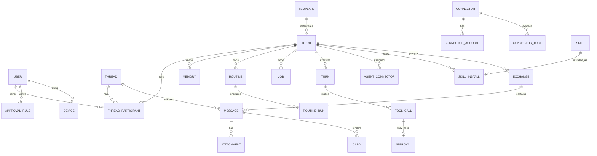

# 05 - Data Model

| Field | Value |
|---|---|
| Version | 0.1 draft |
| Date | 2026-09-12 |
| Store | PostgreSQL 16 (system of record), Redis (queues, ephemeral), object storage (blobs), per-agent volume (workspace, Claude config) |

## 1. Entity overview



## 2. Tables

### user
| Column | Type | Notes |
|---|---|---|
| id | uuid pk | |
| email | text unique | |
| display_name | text | |
| avatar_file_id | uuid fk file | |
| timezone | text | IANA |
| locale | text | nl-NL, en-US |
| auth (separate tables) | | passkeys, totp_secret (encrypted), sessions |
| org_id | uuid fk org | Phase 3 |
| role | enum | owner, admin, member, viewer (Phase 3) |
| created_at | timestamptz | |

### agent
| Column | Type | Notes |
|---|---|---|
| id | uuid pk | also the sandbox volume name |
| owner_user_id | uuid fk | |
| name | text | person name, unique per owner |
| title | text | role label (badge) |
| description | text | short |
| avatar_file_id | uuid fk file | |
| instructions_md | text | system prompt body |
| harness | enum | claude_code, codex, gemini, grok_build, api_loop |
| model | text | free text, passed to the harness; default from harness catalog |
| harness_settings | jsonb | only keys the harness supports: effort, reasoning, approval_mode, sandbox_level, max_turns |
| capabilities | jsonb | e.g. {"manage_agents": true} |
| parent_agent_id | uuid fk agent | creator agent, nullable |
| created_by | enum | user, agent, template |
| template_id | uuid fk template | nullable |
| status | enum | active, paused, archived |
| primary_thread_id | uuid fk thread | |
| notifications_enabled | bool | |
| created_at, updated_at | timestamptz | |

### thread
| Column | Type | Notes |
|---|---|---|
| id | uuid pk | |
| kind | enum | primary, group, exchange |
| title | text | group title; exchange: "A <-> B" |
| owner_user_id | uuid fk | |
| lead_agent_id | uuid fk agent | for group turn policy |
| last_message_at | timestamptz | for sidebar sort |
| created_at | timestamptz | |

### thread_participant
| Column | Type | Notes |
|---|---|---|
| thread_id | uuid fk | pk part |
| participant_type | enum | user, agent |
| participant_id | uuid | pk part |
| harness_session_id | text | per (agent, thread, harness) session id; reset when the agent switches harness |
| harness | enum | harness the session belongs to |
| last_read_message_id | uuid | unread computation |

### message
| Column | Type | Notes |
|---|---|---|
| id | uuid pk | |
| thread_id | uuid fk | |
| sender_type | enum | user, agent, system |
| sender_id | uuid | |
| kind | enum | text, event, card, file, image_gallery, link_preview, status |
| body_md | text | markdown |
| event | jsonb | {type: routine_created, routine_id, title} etc. |
| reply_to_message_id | uuid | quote-reply |
| turn_id | uuid fk turn | which turn produced it |
| created_at | timestamptz | |

Indexes: (thread_id, created_at), full-text index on body_md.

### attachment
| Column | Type | Notes |
|---|---|---|
| id | uuid pk | |
| message_id | uuid fk | |
| file_id | uuid fk file | |
| role | enum | upload, output, avatar, evidence |

### file
| Column | Type | Notes |
|---|---|---|
| id | uuid pk | |
| owner_user_id | uuid | |
| storage_key | text | object storage path |
| name, mime, size_bytes, sha256 | | |
| derived_from_file_id | uuid | e.g. JPEG from HEIC |
| created_at | timestamptz | |

### card
| Column | Type | Notes |
|---|---|---|
| id | uuid pk | |
| message_id | uuid fk | |
| kind | enum | choice, approval, connect, template_review, job_update |
| spec | jsonb | question, options, multi, free_text, connector_id, tool, args_summary |
| state | enum | open, answered, dismissed, expired, allowed, denied |
| answer | jsonb | selected option ids, free text, decided_by, decided_at |
| expires_at | timestamptz | approvals |

### memory
| Column | Type | Notes |
|---|---|---|
| id | uuid pk | |
| agent_id | uuid fk | |
| kind | enum | fact, preference, rule, profile, log, open_loop |
| waiting_on | text | open loops only: connector:<key>, tool:<name>, date:<iso>, user_answer, person:<name> |
| status | enum | open, closed (open loops) |
| embedding | vector(384) | pgvector; built on insert/update |
| created_by | enum | agent, user, extractor |
| text | text | short natural language |
| personal | bool | excluded from template export when true |
| source_message_id | uuid | provenance |
| created_by | enum | agent, user |
| created_at, updated_at | timestamptz | |

### routine
| Column | Type | Notes |
|---|---|---|
| id | uuid pk | |
| agent_id | uuid fk | |
| name | text | |
| instruction | text | |
| active | bool | |
| trigger | jsonb | {type: once, at} \| {type: cron, expr, tz} \| {type: webhook, secret} |
| context | jsonb | attachment file ids, thread id |
| one_shot | bool | delete after success |
| idempotency_key | text unique | (agent_id, key) |
| next_run_at | timestamptz | |
| created_at, updated_at | timestamptz | |

### routine_run
| Column | Type | Notes |
|---|---|---|
| id | uuid pk | |
| routine_id | uuid fk | |
| started_at, finished_at | timestamptz | |
| status | enum | queued, running, succeeded, failed, skipped |
| turn_id | uuid fk turn | |
| summary | text | |
| error | text | |

### job
| Column | Type | Notes |
|---|---|---|
| id | uuid pk | |
| agent_id | uuid fk | |
| title | text | "[Agent] verb + object" |
| goal | text | |
| status | enum | queued, in_progress, waiting_on_user, blocked, done |
| next_step | text | |
| waiting_on | text | |
| requested_by | enum | user, agent, routine |
| external_ref | jsonb | e.g. ClickUp task id when mirrored |
| created_at, updated_at, done_at | timestamptz | |

### job_note
| id, job_id, text, created_at | progress beats |

### turn
| Column | Type | Notes |
|---|---|---|
| id | uuid pk | |
| agent_id, thread_id | uuid | |
| kind | enum | user_message, agent_message, routine, system |
| trigger_message_id | uuid | |
| claude_session_id | uuid | |
| runner | enum | cli, sdk |
| model, effort | | |
| status | enum | queued, running, waiting_approval, succeeded, failed, cancelled |
| started_at, finished_at | timestamptz | |
| usage | jsonb | input_tokens, output_tokens, cache_read, cache_write, cost_estimate_usd |
| result_meta | jsonb | permission_denials, num_turns, stop reason |
| error | text | |

### tool_call
| Column | Type | Notes |
|---|---|---|
| id | uuid pk | |
| turn_id | uuid fk | |
| tool_name | text | e.g. mcp__gw_outlook__list_mail_messages |
| connector_id | uuid | nullable for built-in tools |
| args_hash | text | sha256 of arguments |
| args_summary | text | redacted short summary for cards/audit |
| decision | enum | allowed, denied_policy, asked, denied_user, allowed_user |
| result_status | enum | ok, error |
| started_at, finished_at | timestamptz | |

### approval
| id, tool_call_id, card_id, decided_by_user_id, decision, decided_at, rule_created (bool) |

### approval_rule
| Column | Type | Notes |
|---|---|---|
| id | uuid pk | |
| user_id | uuid | |
| scope | jsonb | {agent_id?: uuid, connector_id?: uuid} |
| when_text | text | "reply to emails for me" |
| matcher | jsonb | compiled: tool name patterns and/or classifier prompt |
| decision | enum | allow, ask, deny |
| created_at | timestamptz | |

### connector
| Column | Type | Notes |
|---|---|---|
| id | uuid pk | |
| key | text unique | outlook, clickup |
| name, description, logo_file_id, source_url | | |
| transport | enum | stdio, http, sse |
| launch | jsonb | command/args/env for stdio, url for http |
| auth_type | enum | none, bearer, oauth2 |
| oauth | jsonb | client id, scopes, auth/token urls (secret in encrypted column) |
| status | enum | installed, error |
| created_at | timestamptz | |

### connector_account
| id, connector_id, user_id, label (email), token_encrypted, refresh_token_encrypted, expires_at, status (connected, expired, revoked) |

### connector_tool
| connector_id, tool_name (pk pair), description, category (read, write, send, delete, pay, other), enabled (bool), requires_approval (bool) |

### agent_connector
| agent_id, connector_id (pk pair), account_id, tool_overrides jsonb {deny: [...], ask: [...]} |

### skill
| id, key, name, description, storage_key (tar.gz), source (upload, agent_created, template), created_at |

### skill_install
| agent_id, skill_id, installed_at |

### template
| id, name, description, author, archive_file_id, spec jsonb (instructions, skills, connectors, memories), published (bool), created_at |

### harness_status
| Column | Type | Notes |
|---|---|---|
| harness | enum pk | claude_code, codex, gemini, grok_build |
| installed | bool | |
| version | text | |
| auth_kind | enum | none, subscription, api_key |
| account_label | text | e.g. email or plan name when the CLI reports it |
| last_checked_at | timestamptz | |
| last_error | text | |
| is_default | bool | |

### exchange
| id, agent_a_id, agent_b_id, thread_id (kind=exchange), message_count, last_message_at |

### device
| id, user_id, kind (web_push, telegram), endpoint/chat_id, keys_encrypted, created_at, last_seen_at |

### audit_log
| id, at, actor_type, actor_id, action, target_type, target_id, details jsonb (no message bodies), turn_id |

### usage_daily
| user_id, agent_id, day, turns, input_tokens, output_tokens, cache_read_tokens, cost_estimate_usd |

## 3. Per-agent volume layout (`/srv/agents/<agent-id>`, mounted at `/agent`)

```
/agent/claude/                 # CLAUDE_CONFIG_DIR
  settings.json                # base permissions (generated)
  CLAUDE.md                    # identity + protocols (generated from agent record)
  skills/<skill>/SKILL.md      # installed skills
  projects/workspace/          # Claude Code transcripts + auto memory
/agent/workspace/              # cwd for every turn
  inbox/<message-id>/          # uploaded files for a turn
  outbox/                      # files the agent shares
  <skill or data folders>      # e.g. training-system/
/agent/prompt/turn.md          # generated per turn (memories, thread context)
/agent/mcp/turn.json           # generated per turn
/agent/settings/turn.json      # generated per turn
```

### event
| Column | Type | Notes |
|---|---|---|
| id | bigserial pk | monotonic; clients resume from it |
| at | timestamptz | |
| type | text | see section 4 |
| thread_id, agent_id, user_id | uuid | routing keys for subscriptions |
| payload | jsonb | |
Retention 7 days for replay; audit_log keeps the durable record.

## 4. Event types (append-only stream used by UI and audit)

`message.created`, `card.created`, `card.answered`, `agent.created`, `agent.renamed`, `agent.avatar_set`, `agent.paused`, `routine.created`, `routine.updated`, `routine.deleted`, `routine.fired`, `job.created`, `job.updated`, `exchange.message`, `turn.started`, `turn.tool_call`, `turn.waiting_approval`, `turn.finished`, `turn.failed`, `connector.connected`, `connector.disconnected`, `connector.enabled_for_agent`, `tool.enabled`, `skill.installed`, `memory.created`, `loop.opened`, `loop.closed`, `usage.updated`.
