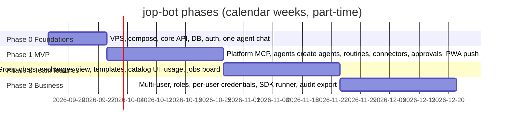

# 07 - Delivery Plan

| Field | Value |
|---|---|
| Version | 0.1 draft |
| Date | 2026-09-12 |
| Team assumption | One senior developer (Jop) with Claude Code as pair programmer; part-time |

## 1. Phases

### Phase 0 - Foundations (2 weeks)
Deliverables
1. Repository skeleton (monorepo), CI with lint and tests.
2. VPS provisioned; Docker Compose with Caddy, Postgres, Redis, MinIO; nightly backup script.
3. Core API: auth (passkey or password + TOTP), threads, messages, files, WebSocket.
4. Runner v1: harness adapter interface, harness detector, sandbox image with all four CLIs installed; `ClaudeCodeAdapter` first; stream-json parsing; session per thread.
5. Web app v1: sidebar, thread view with streaming, composer with file upload and mic, PWA manifest.
Exit criteria: Jop chats with one agent from his phone; a zip upload is unpacked in the workspace.

### Phase 1 - MVP (4 weeks)
1. Platform MCP server: ask_user, request_approval, remember/recall, create/update_job, routines, share_file, set_profile, create_agent, send_message_to_agent, get_my_connectors, report_status.
2. Agent creation by chat and from a skill zip; rename and avatar by chat; details panel with settings, memories, routines, files.
3. Scheduler with cron, one-shot, webhook; timers with push; idempotency.
4. Connectors: gateway with policy filtering; Outlook limited MCP (stdio, from ~/Projects/prive/outlook-mcp) and ClickUp remote MCP with OAuth; tool switches per connector and per agent.
5. Approval cards with push; hard limits; pause/resume agent.
6. Concierge default agent with onboarding interview and protocols.
7. Usage counters per agent per day.
8. Second harness: `CodexAdapter` (proves the abstraction; approvals moved to the gateway for all harnesses); per-agent harness and model settings UI (dropdown + custom model + advanced).
Exit criteria: the seven Phase 1 success criteria in 01-vision-and-scope.md section 8, plus one agent running on Codex while another runs on Claude Code.

### Phase 2 - Team features (4 weeks)
1. Group threads with turn policy and sender labels; "To:" new-chat flow.
2. Exchange overlay (read-only transcripts); broadcast.
3. Templates export/import; private skills; internal catalog UI (connectors and agent templates).
4. Jobs board view; optional mirror to ClickUp.
5. Approval rules in plain language (classifier with `claude-haiku-4-5`).
6. Telegram bridge; quiet hours.
7. Usage view with 5-hour and weekly warnings, per harness.
8. `GeminiAdapter` and `GrokBuildAdapter`; harness switch for an existing agent with context replay.

### Phase 3 - Business (4 weeks, after a go decision)
1. Organizations, roles, invitations; per-agent visibility.
2. Per-user model credentials; `AgentSdkRunner` with API keys; SSO (OIDC).
3. Audit log export; retention settings; GDPR deletion.
4. Hardening: Vault or SOPS for secrets, restore drill, monitoring dashboards.

## 2. Effort estimate (person-days, rough, includes tests)

| Phase | Item | Days |
|---|---|---|
| 0 | Infra, compose, backups | 3 |
| 0 | Core API, auth, DB | 5 |
| 0 | Runner v1 + sandbox image | 4 |
| 0 | Web v1 | 5 |
| 1 | Platform MCP server | 5 |
| 1 | Agent lifecycle + details panel | 5 |
| 1 | Scheduler, timers, push | 4 |
| 1 | Gateway + 2 connectors + switches | 6 |
| 1 | Approvals, hard limits, pause | 3 |
| 1 | Concierge prompts, onboarding | 3 |
| 1 | Usage counters | 2 |
| 1 | Harness abstraction, detector, Codex adapter, settings UI | 6 |
| 2 | Gemini and Grok Build adapters, harness switch | 5 |
| 2 | Group threads, exchanges, broadcast | 6 |
| 2 | Templates, skills, catalog UI | 6 |
| 2 | Jobs board, rules classifier, Telegram, usage view | 7 |
| 3 | Orgs, roles, SDK runner, SSO, audit, hardening | 20 |
| | **Total** | **95 days** (Phases 0-2: 75) |

## 3. Milestones and demos

| Milestone | Demo |
|---|---|
| M0 (end Phase 0) | "Hello Linh" from the phone; zip unpacked |
| M1 (end Phase 1) | Linh creates Thijs from chat, briefs him; Thijs reads Outlook mail (send disabled), reports back; reminder fires with push; approval card on a draft update |
| M2 (end Phase 2) | Group chat with Linh and Nico; export Niek as template and re-import; jobs board |
| M3 (end Phase 3) | Second user with own API key in an org; audit export |

## 4. Risks and mitigations

| # | Risk | Likelihood | Impact | Mitigation |
|---|---|---|---|---|
| R1 | Anthropic changes subscription policy or blocks headless subscription use | Medium | High | Runner switch to API key; monthly budget cap; keep usage "ordinary" |
| R2 | Subscription window exhausted by many agents | Medium | Medium | Concurrency cap, Sonnet for high-volume agents, usage warnings, queueing |
| R3 | Vendor CLI event formats or flags change between versions | High | Medium | Pin every CLI version in the sandbox image; contract tests per adapter with recorded fixtures |
| R9 | A vendor forbids headless subscription use on a server | Medium | High | Per-harness API-key switch; detector shows auth kind; usage kept ordinary |
| R4 | Remote MCP OAuth differs per vendor | Medium | Medium | Gateway owns OAuth; start with two connectors |
| R5 | Prompt injection through mail or web content | Medium | High | Send/delete tools off by default; approval cards; tool output labeled as data |
| R6 | Timer reliability on a single VPS | Low | Medium | BullMQ with persistence; watchdog; alert on missed runs |
| R7 | Scope creep toward Grok Bot parity (cloud desktop) | High | Medium | Non-goals in 01; MCP-only rule |
| R8 | Single developer bandwidth | High | Medium | Phase gates; MVP first; skip Phase 2 items that are not needed personally |

## 5. Open decisions for Jop

| # | Decision | Options | Recommendation |
|---|---|---|---|
| D1 | Product name | any | Pick before Phase 0 (repo is jop-bot) |
| D2 | Stack | A) TypeScript everywhere; B) Python core + TS web | A (one language, SDKs are TS-first) |
| D3 | Mobile | A) PWA; B) native later | A for Phases 0-2 |
| D4 | Push fallback | A) Telegram; B) none; C) ntfy.sh self-hosted | A (already used in Claude Code channels ecosystem), C if no Telegram |
| D5 | Object storage | A) MinIO; B) local disk abstraction | B for single-user simplicity, A when multi-user |
| D6 | Board mirror | A) ClickUp via connector; B) internal board only | B first, A as connector when wanted |
| D7 | Headless browser connector | A) Playwright MCP later; B) never | A in Phase 2+ only if a use case appears; gated like any tool |

## 6. Definition of done (per feature)
- Unit tests for policy, scheduler idempotency, stream parsing.
- Integration test: one full turn against a stub `claude` binary that replays stream-json fixtures.
- Manual test on iPhone Safari PWA.
- Documentation updated (functional design and API spec).
