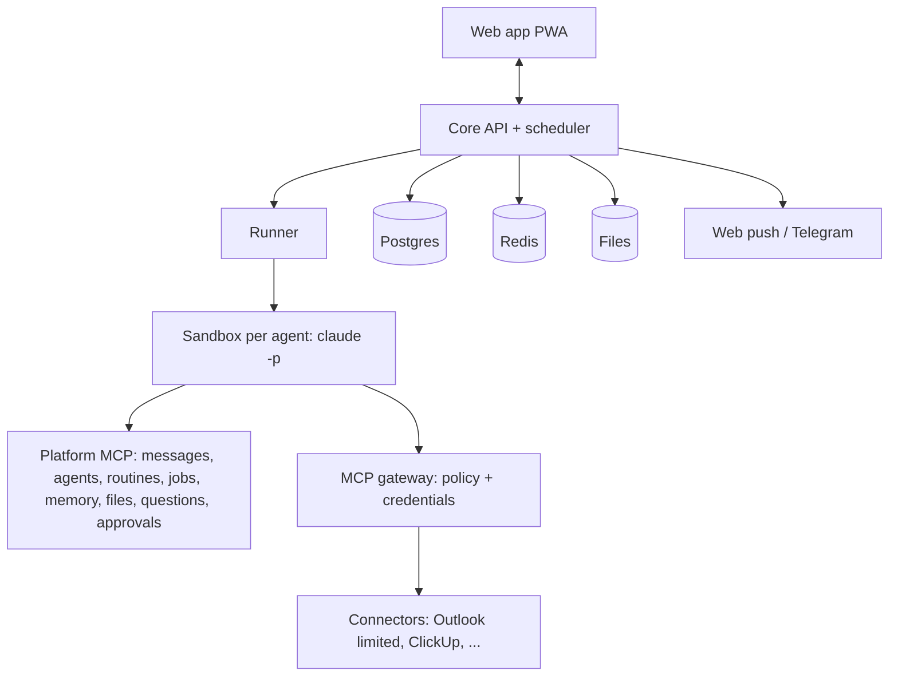

# jop-bot design spec (summary for review)

Date: 2026-09-12. Status: awaiting Jop's review. Detailed documents: ../../README.md.

## What we build
A self-hosted, chat-first platform where the user talks to a concierge agent that creates, briefs, and manages specialist agents. Agents run as headless Claude Code sessions on a single VPS using Jop's Max subscription. Agents act only through MCP tools that the user switches on per tool, and through a private file workspace. Routines, approvals, files, memories, group chats, and an internal catalog of connectors and agent templates complete the picture.

## Architecture in one picture

## Key decisions (see 08-decision-log.md)
1. Vendor agent harnesses (Claude Code, Codex CLI, Gemini CLI, Grok Build) run unmodified and headless, one adapter each, chosen per agent; the server detects which are installed and logged in. Claude Code with `claude setup-token` is the first adapter. Subscriptions are used only by their owner; business use switches to API keys per harness.
2. No cloud desktop. MCP + workspace only. Headless browser only as a future switchable connector.
3. Enforcement in the MCP gateway for every harness (filtered tool lists, blocked calls, approvals held at the gateway); harness-native permission rules are an extra layer where available.
4. One sandbox container per agent; one Claude session per (agent, thread); agent memory shared across threads.
5. Platform actions (create agent, message agent, routines, jobs, cards) are MCP tools with server-side rules: briefing required, idempotent routines, hop caps.
6. Scheduler and notifications owned by the platform (web push first, Telegram second).

## Scope of the first implementation plan (Phase 0 + Phase 1)
Foundations (VPS, compose, core API, auth, runner, web) and the MVP (platform MCP, agent lifecycle by chat, routines with push, Outlook limited + ClickUp connectors with tool switches, approvals, concierge onboarding, usage counters). Exit criteria are the seven items in 01-vision-and-scope.md section 8.

## Out of scope
Public marketplace, cloud desktop, local computer execution, sharing the subscription with other people.

## Open questions for Jop (answers change the plan)
1. Product name.
2. TypeScript for everything (recommended) or Python core?
3. Telegram as push fallback (recommended) or web push only?
4. Which VPS (assumed 4 vCPU / 8 GB / 80 GB)?
5. Do we start with the internal jobs board only, or mirror to ClickUp from day one?

## Next step after approval
Write the implementation plan for Phase 0 with the writing-plans skill, then execute with test-driven development.
